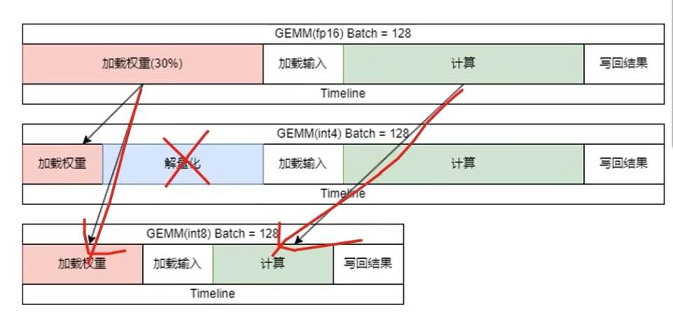

# Basic model structure

## Matmul
90% in GPU total running time \
Q、K、V、O each costs 30 GPU time

## Attention
increase with seq_len^2

## Silu

## RMSnorm、Layernorm

## RoPE

## KV-cache

# LLM inference

## prefill

QK 矩阵乘法
softmax
再和 V 矩阵乘法

## decoding
只输入上一个词，所生成的新k和原始的kv-cache做拼接

# LLM Benchmark

1.单位时间输出token数量
2.首字延迟，输出延迟
3.每秒处理请求数

## 优化1:流水线前后处理与高性能采样

文本转换为向量，一次性输入全部文本。相应的，在得到向量后，要进行detokenize。这两个步骤都是在CPU上完成的。\
1. 3线程，其中两个执行tokenize和detokenize
2. 另一个执行 GPU computing
3. 当上一个计算的结果在进行detokenize时，就可以开启下一个token的计算

## 优化2:动态批处理

用户1: pre + decoding\
用户2: pre + decoding\
我们只有1个设备，如果在用户2的decoding可能会和用户1的发生冲突。\

用户1: decoding 阶段 输入1个词向量 \
用户2: prefill 阶段 输入48个词向量 \

在 Attention 步骤要进行分流。

## 优化3:decoding attention

## 优化4:VM allocator

- kv-cache：
    - 用户输入文本的长度+decode。
    - 每个用户的缓存大小不一样。
    - 但是一开始不知道缓存大小的需求，这就导致在显存预分配时有不同的策略。

- pytorch 分配策略: 
    - 给每个请求都分配最大长度。
    - 会浪费空间，导致同时服务的用户数量减少。

- paged attention: 
    - 分配页框：8token。
    - 服务的用户是pytorch的两倍，但不知道系统上限，后续batch越大，QPS越低。
    - 此外，llm bacth > 768 没必要开，会导致性能下降。

- vm 
    - 预测所生成的序列长度。

- Mem Offload
    - GPU显存带宽是PCIe的30～40倍。
    - 切换1GB数据需要20ms，所有用户少一次decoding。
    - 直接踢用户反而快。

## 优化5:kv-cache 量化

- 有损压缩
- 分组量化，算子融合，需要手写attention。

    - 基本不会错。

## 优化6:矩阵乘法量化

- all step
    - 插入量化算子
    - 插入反量化算子 --> 开销高 --> 算子融合
    - 替换矩阵乘法算子
    - 对int8权重进行预处理
    - 不量化O的矩阵乘法

## 优化7:int8 VS int4

- batch size 越大，解量化所需时间越长

- i 的长度是 batch_size

- 服务端使用

## 优化8:int4 vs 非线性量化

## 硬件选型

- 访存延迟：16/900 = 22.22 上限
- 计算延迟：计算量 / 112 = 3.3 
- 两者取最大值

- 吞吐量：16 * 1000/22.22 = 720
- 通信延迟: 176B --> A100

